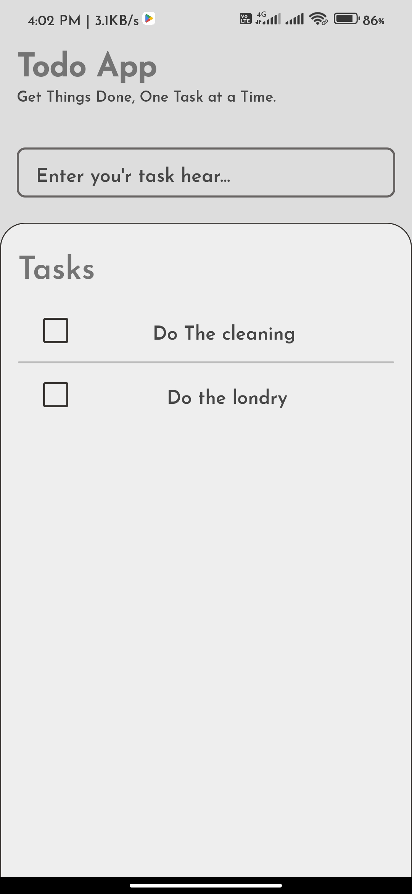
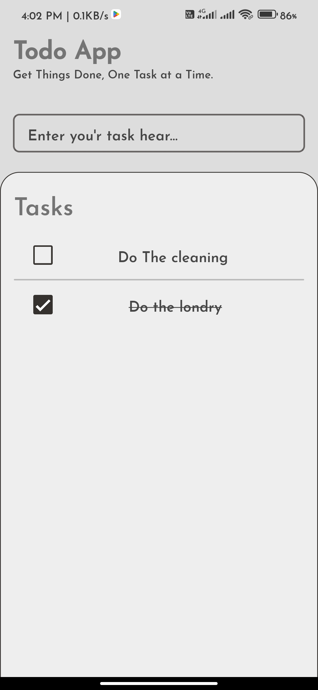
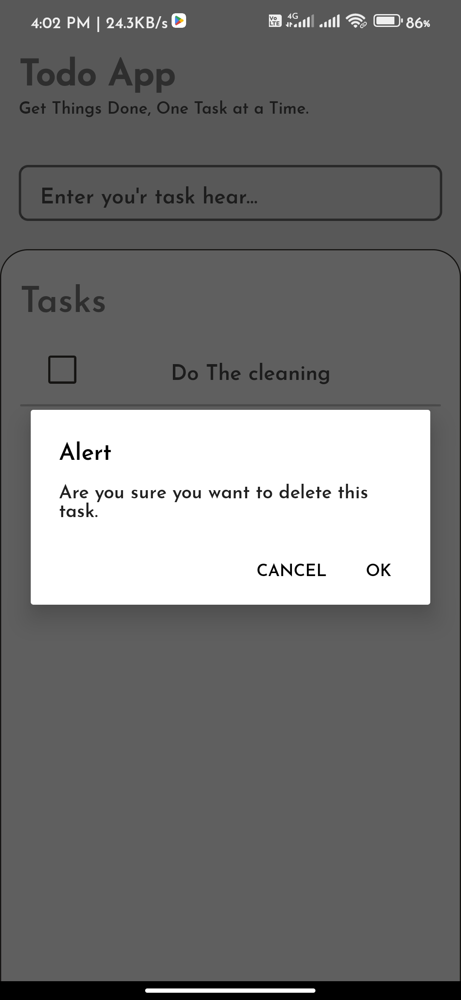
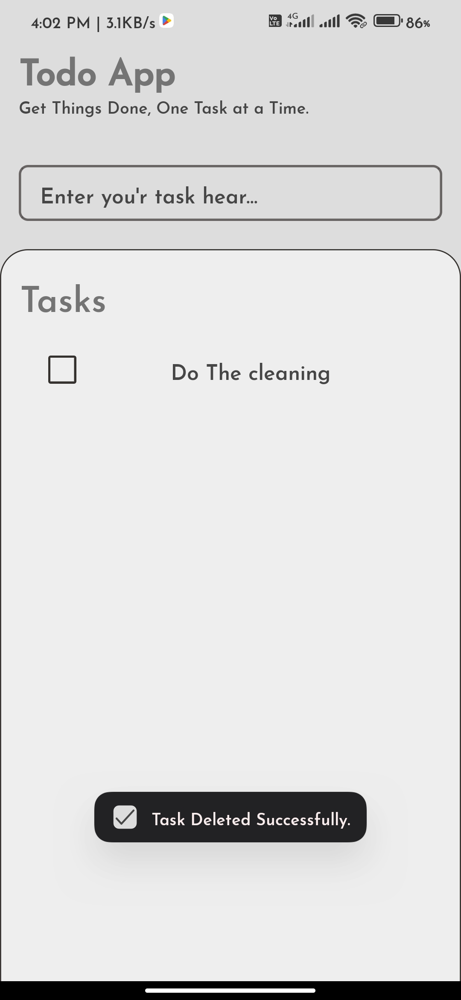

# React Native To-Do App

This is a simple To-Do app built using React Native and Expo. The app allows users to add, and delete tasks, helping them manage their daily activities efficiently.

## Features

- **Add Tasks**: Users can add new tasks to their to-do list.
- **Delete Tasks**: Users can delete tasks from their list.
- **Persistent Storage**: Tasks are saved locally on the device using AsyncStorage, ensuring they remain available even after the app is closed.
- **Responsive UI**: The app is designed to be responsive and user-friendly on both Android and iOS devices.

## Download

You can download the APK file to install the app on your Android device:

- [Download APK](./Todo.apk)

## Usage

- Launch the app and start adding your tasks.
- Log Press on task to delete the task.
- Tasks will be saved automatically, so you can pick up where you left off.

## Screenshots

